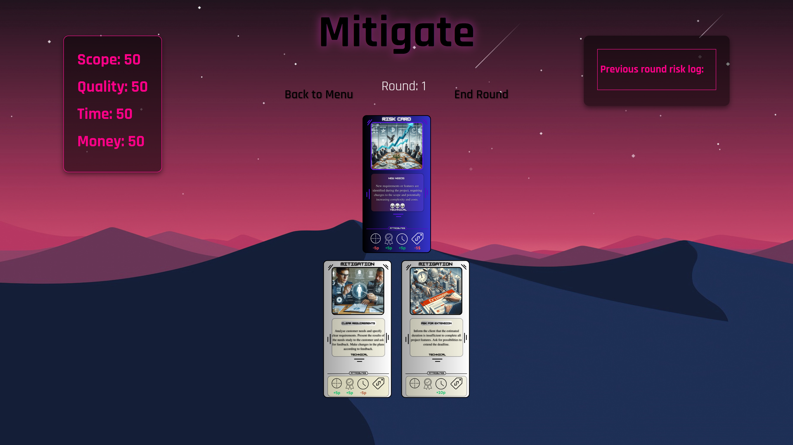
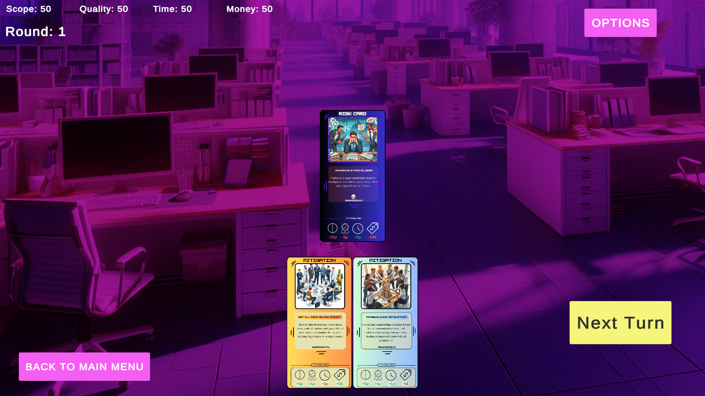

# Mitigate Online

## React Version


## Unity Version


## Description
Mitigate Online is a digital adaptation of a physical card game designed to educate young entrepreneurs and business owners about various risks in the business world and how to effectively mitigate them. Our goal is to create a fully functional and aesthetically pleasing game that teaches the principles of risk management through engaging gameplay. The UI and cards are designed by our team to enhance the learning experience.

## Institution and Course
This project was created as part of the summer internship course in the Informatics program at Tallinn University, specifically within the School of Digital Technologies.

## Technologies Used
- **Discord**: Communication
- **ReactJS**: JavaScript framework
- **Canva**: Design tool for [risk cards](https://www.canva.com/design/DAGHzrgkmQU/S8lpU7WQIY3Jz9kPI5O-QQ/edit) and [mitigation cards](https://www.canva.com/design/DAGH0KPXCLM/hpNL3x3yqOB3j4lMMSY3SQ/edit)
- **Unity**: Game development
- **Figma**: Prototyping tool for [design](https://www.figma.com/design/uwN3eKdVG1K18j0c0wdXE6/Mitigate?node-id=0-1&t=dCoVEEmwbBbSax01-0)

## Installation and Setup
### Running the Unity App
1. Clone the repository:
    ```bash
    git clone https://github.com/yourusername/mitigate-online.git
    ```
2. Navigate to the Unity project directory:
    ```bash
    cd mitigate-online/UnityProject
    ```
3. Open the project in Unity Editor.
4. Build and run the project from Unity.

### Running the React App
1. Switch to the `Mitigate-React` branch:
    ```bash
    git checkout Mitigate-React
    ```
2. Navigate to the React app directory:
    ```bash
    cd mitigate-online/react-app
    ```
3. Install dependencies:
    ```bash
    npm install
    ```
4. Start the development server:
    ```bash
    npm start
    ```

## Learning Goals
Players will learn:
- Real-world examples of risks and their potential impacts on project objectives.
- Effective countermeasures and their impacts on risks.
- The iterative nature of risk management.
- Integration of risk management within the broader context of project management.

## Contributors
- Eerik Poopuu
- Hannes Väster
- Kristjan Petersell
- Erik Brück
- Kristjan Peedisson

## License
This project is licensed under the MIT License - see the [LICENSE](LICENSE) file for details.
